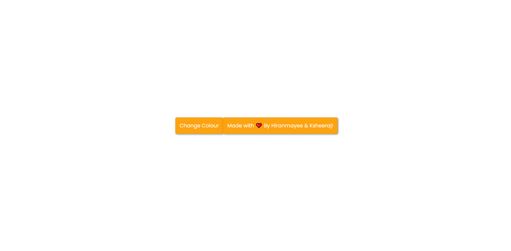
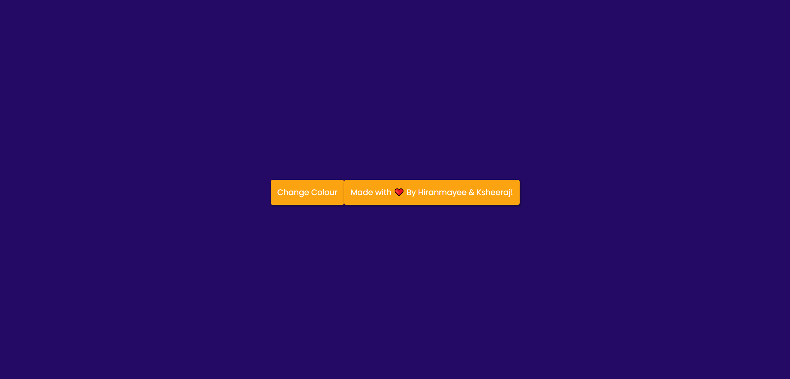
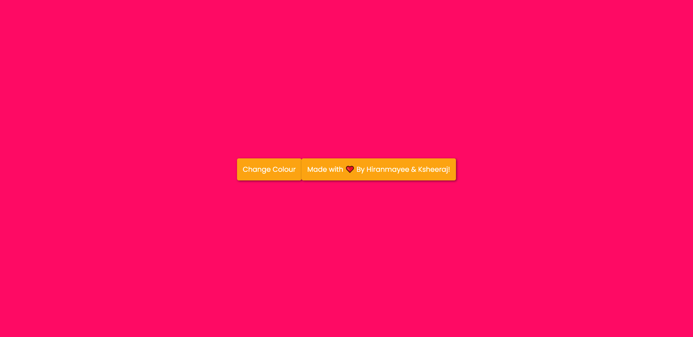

# Background-Colour-Changer

View different background colours for the webpage for each click.

### Language used :
- HTML
- CSS
- JavaScript

### Platform used :
- Visual Studio Code

### Sample Screenshot :
</img>  
</img>  
</img>  

### Team Member :
- [Sai Hiranmayee](https://github.com/hiranmayee1123)

